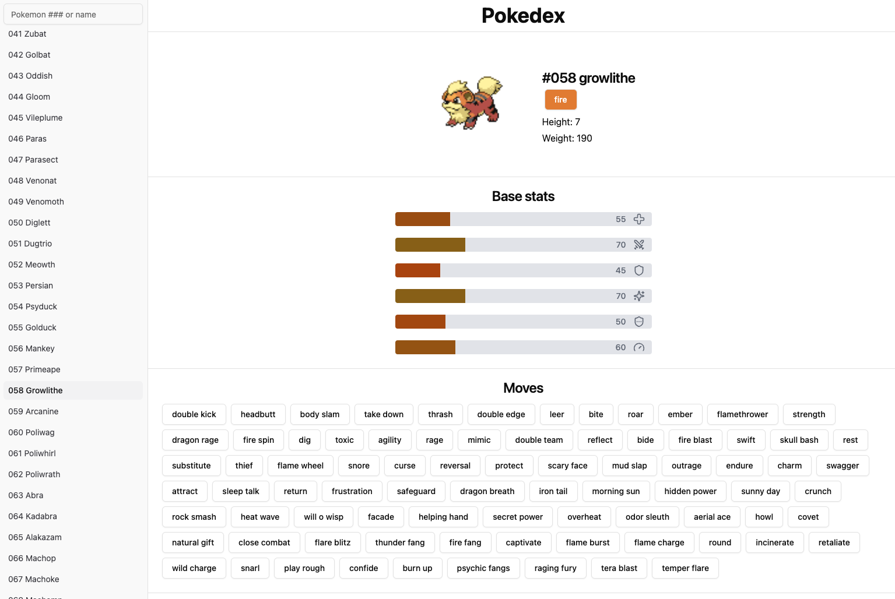

# Pokédex React App



## 🌟 Overview

The **Pokédex React App** is a sleek and interactive web application that allows users to explore a comprehensive collection of Pokémon using data from the [PokéAPI](https://pokeapi.co/api/v2/). This project was features a front-end desing using **React.js**, API integrations, and a responsive design.

## ✨ Features

- 🔍 **Search & Explore:**
  - Search for Pokémon by name or ID.
  - View detailed Pokémon information, including:
    - Name
    - Type(s)
    - Base stats
    - Sprites
  
- 📄 **Navigation side bar:**
  - Browse through the entire fire red/leaf green Pokémon collection with efficient data fetching.
  
- 🎨 **Responsive Design:**
  - Optimized for desktop, tablet, and mobile devices.

## 🛠️ Built With

- **Javascript:** To handle all of the back end
- **React.js:** Front-end framework for creating dynamic user interfaces.
- **Fetch API:** For seamless integration with the [PokéAPI](https://pokeapi.co/api/v2/).
- **Tailwind CSS:** Ensures clean and modern styling.
- **Git & GitHub:** Version control and project hosting.

## 🚀 How to Run the Project

### Prerequisites

- Node.js and npm installed on your machine.
- Basic understanding of React.js, JavaScript, and Tailwind CSS.
- Familiarity with shadcn/ui for component-based styling.

### Installation Steps

1. Clone the repository:
   ```bash
   git clone https://github.com/alberu/pokedex.git
   cd pokedex
   ```
2. Install dependinces the repository:
   ```bash
   npm install
   ```
3. Setup Tailwind CSS:
   - Ensure the Tailwind configuration is correct. The `tailwind.config.js` file should have relevant configurations for shadcn and your project.
   npm run dev
   - If needed, generate Tailwind classes or utilities:
   ```bash
   npx tailwindcss init
   ```
4. Start the develoments server using Vite:
   ```bash
   npm run dev
   ```
5. Open your browser and navigate to the URL show in the terminal which should also be the one below (usually):
   ```
   http://localhost:5173
   ```


